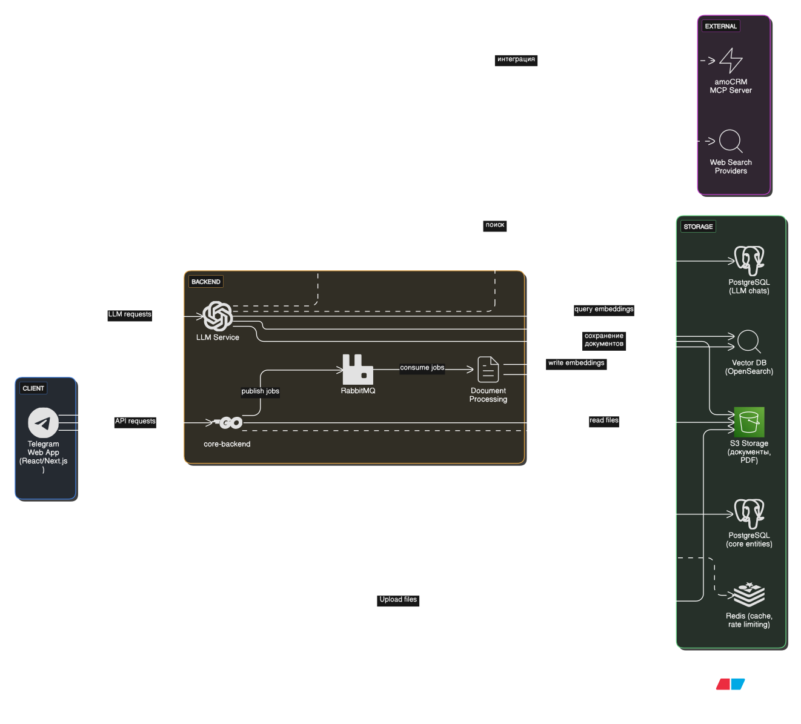

# BusinessThing — LLM‑помощник для владельцев малого и среднего бизнеса (Telegram Web App)

## 🧩 Назначение
BusinessThing предоставляет владельцу и команде малого/среднего бизнеса персонального интеллектуального помощника внутри привычного интерфейса Telegram. Приложение агрегирует контекст компании, внутренние документы, знания субагентов (маркетинг, право, финансы) и внешние источники (amoCRM, веб‑поиск) для ускорения принятия решений и подготовки материалов.

**📱 Telegram бот:** [Открыть](https://t.me/business_thing_bot)
**📋 Техническое задание:** [Открыть](https://docs.google.com/document/d/129uhV9V3wJJ2HFG88s_8OzzRsO_g1PbeRN6mLtWn57k/edit?usp=sharing)
**📋 User-flow:** [Открыть](https://docs.google.com/document/d/1H7cYwaE2WRLZJdFTDWhI5BJNqIqEJ-i2P8NxTVVISx0/edit?usp=sharing)

## 💼 Бизнес‑ценность

### 🎯 Проблема
У владельцев малого и среднего бизнеса часто **недостаточно времени и компетенций** для решения профильных задач: подготовки юридических документов, анализа маркетинговых кампаний, финансового планирования. Обращение к внешним консультантам дорого и требует времени, а удержание в голове всей информации о компании, клиентах и документах — невозможно.

### ✨ Решение
**BusinessThing — это интеллектуальный ассистент**, который:
- **Компенсирует нехватку компетенций** через профильных субагентов (маркетинг, право, финансы) с доменной экспертизой и специализированными инструментами
- **Экономит время** на рутинных задачах: генерация договоров, анализ данных, подготовка материалов
- **Централизует знания компании** в едином контексте, доступном 24/7 через привычный Telegram

## 🧠 Технологии улучшения контекста
Для повышения качества ответов и актуальности информации используются:

1. **RAG (Retrieval-Augmented Generation)** — векторный поиск по базе знаний организации:
   - Загруженные документы (договоры, регламенты, презентации)
   - Исторические данные и артефакты
   - Шаблоны и лучшие практики

2. **LLM-заметки** — ассистент сохраняет важные факты об организации в структурированном виде для дальнейшего использования

3. **Веб-поиск** — актуализация информации из внешних источников в реальном времени

4. **MCP-доступ к CRM (amoCRM)** — прямая интеграция с данными о клиентах, сделках и задачах компании

## 👥 Профильные субагенты
Каждый субагент имеет специализированные промпты и набор инструментов для своей области:

- **Маркетолог**: управление кампаниями, анализ конверсий, работа с лидами в CRM
- **Юрист**: генерация договоров из шаблонов, юридические консультации
- **Финансист**: бюджетирование, анализ рентабельности, прогнозирование
- **Бизнес-аналитик**: глубокая аналитика данных CRM, выявление трендов и инсайтов

**Детальное распределение инструментов amoCRM:** [AMOCRM_TOOLS_DISTRIBUTION.md](./llm-service/AMOCRM_TOOLS_DISTRIBUTION.md)

## 📄 Генерация договоров из шаблонов (СЕЙЧАС В СИСТЕМЕ ЕСТЬ ТОЛЬКО "Акт приема-передачи займа")
Одна из ключевых функций — **автоматизированная генерация юридических документов**:
- Используются готовые профессиональные шаблоны с сайта **"Альфа курс"**
- Все шаблоны загружены в **векторную БД** (OpenSearch) для семантического поиска
- LLM находит **подходящий договор** по описанию пользователя
- LLM определяет **список необходимых полей** для заполнения
- Через диалог запрашивает данные у пользователя
- После получения всех данных **рендерит финальный документ** (PDF/DOCX)
- Результат сохраняется в S3 с возможностью повторного использования

### 🏢 Менеджмент организации и пользователей
- **Многопользовательские организации**: создание компании, приглашение сотрудников одноразовыми ссылками
- **Ролевая модель**: Admin (владелец) и Employee с разными уровнями доступа
- **Изоляция данных**: жесткое разграничение контекстов между организациями
- **Расширяемая анкета организации**: название, сфера, регион, оборот, сотрудники и другие параметры для персонализации ответов

### 📊 Измеримые выгоды
- **Сокращение времени** на подготовку типовых договоров с 2-3 часов до 10-15 минут
- **Централизованный «мозг» компании**: единый контекст, заметки, документы, история генераций
- **Снижение зависимости** от внешних консультантов благодаря встроенной экспертизе
- **Быстрый старт** без установки: доступно как Telegram Web App (desktop + mobile)
- **Повышение качества решений** за счет актуальных данных из CRM и веб-источников

## 🔥 Боли, которые решаем
| Боль | Решение |
|------|---------|
| Разрозненные знания и файлы | Единое хранилище + векторный поиск + заметки LLM |
| Долгая подготовка типовых договоров | Генерация из шаблонов с автозаполнением и экспортом PDF/DOCX |
| Отсутствие системного маркетингового и финансового анализа | Профильные субагенты с инструментами (кампании, KPI, точка безубыточности) |
| Сложный онбординг новых сотрудников | Контекст организации и документы доступны сразу внутри Telegram |
| Нет актуализации ответов модели | Веб‑поиск + интеграции (amoCRM) для освежения данных |
| Риск утечки межорганизационных данных | Жесткая изоляция контекстов организаций + ролевая модель доступа |

## ✅ Ключевые возможности (MVP / PoC)
1. Создание организации и заполнение расширяемой анкеты (название, сфера, регион, оборот, сотрудники и др.).
2. Управление пользователями: приглашения одноразовой ссылкой, роли (Admin, Employee).
3. Общение с LLM в контексте организации (общие вопросы, рекомендации, анализ).
4. Заметки LLM об организации: просмотр/удаление, централизованное хранение.
5. RAG: загрузка документов (PDF, DOCX, TXT), извлечение текста, векторизация, поиск релевантных фрагментов.
6. Субагенты: маркетинг / право / финансы — маршрутизация запросов, специализированные промпты и инструменты.
7. Правовой агент: шаблоны договоров с параметрами → диалоговое заполнение → генерация → экспорт PDF/DOCX → список сгенерированных договоров.
8. Интеграция с amoCRM (через MCP сервер) — использование данных для обогащения контекста (PoC, хардкод аккаунта).
9. Веб‑поиск для проверки фактов и добавления свежих источников в промпт.
10. Безопасность: изоляция данных организаций, ролевая модель доступа к документам, заметкам и сгенерированным артефактам.

## 👥 Роли
- Admin (владелец организации): полный доступ, управление интеграциями, документами, пользователями.
- Employee (сотрудник): использование LLM, субагентов, документов (с учетом политики доступа).

## 🏛 Архитектура

**Мониторинг и логирование:**
- Jaeger (distributed tracing)
- Dozzle (логи контейнеров)
- (Future) ClickHouse (аудит запросов)

## 🧠 Потоки данных (основные сценарии)
1. **Запрос пользователя к LLM:**
   - WebApp → LLM Service напрямую
   - LLM Service: Retrieval из Vector DB (query embeddings) + заметки + шаблоны из PostgreSQL
   - Сбор параметризованного промпта
   - Вызов LLM → Ответ + цитаты источников
   - Сохранение истории чата в PostgreSQL (LLM chats)

2. **Генерация договора из шаблона:**
   - Библиотека шаблонов от "Альфа курс" загружена в Vector DB (OpenSearch) для семантического поиска
   - WebApp → LLM Service: запрос на создание договора
   - LLM выполняет векторный поиск подходящего шаблона по описанию пользователя
   - LLM определяет список необходимых полей для заполнения → запрашивает их у пользователя через диалог
   - После получения всех данных LLM рендерит шаблон с подстановкой значений
   - Генерация финального документа (PDF/DOCX) → сохранение в S3 → запись метаданных в PostgreSQL

3. **Загрузка и индексация документа:**
   - WebApp → S3: загрузка файла
   - WebApp → core-backend: создание записи документа
   - core-backend → RabbitMQ: публикация задачи на обработку
   - Document Processing: consume задачи из RabbitMQ
   - Document Processing → core-backend (gRPC): обновление статуса на PROCESSING
   - Document Processing: извлечение текста, разбиение на чанки, генерация embeddings
   - Document Processing → Vector DB: индексация (write embeddings)
   - Document Processing → core-backend (gRPC): обновление статуса на INDEXED или FAILED

4. **Интеграция amoCRM:**
   - LLM Service ↔ amoCRM MCP Server
   - Пуллинг / запрос данных CRM → нормализация
   - Включение сущностей (лиды, сделки) в контекст промптов

5. **Веб‑поиск:**
   - LLM Service → Web Search Providers: триггер инструмента поиска
   - Получение актуальных данных → краткие выдержки
   - Встраивание результатов в финальный промпт (с ограничением объема)

## 🧩 Компоненты
| Компонент | Ответственность |
|----------|-----------------|
| **frontend** | Telegram Web App UI, формы анкеты, чат с LLM, генерация договоров, загрузка файлов в S3 |
| **core-backend** | HTTP/gRPC API, аутентификация, управление ролями, CRUD организаций/пользователей/документов, публикация задач в RabbitMQ |
| **llm-agent** | Прямая обработка запросов от клиента, оркестрация LLM, промпты, субагенты, RAG (query из Vector DB), юридическая логика, интеграции (amoCRM, Web Search) |
| **vector-service** | Пассивное хранилище векторных представлений (OpenSearch), обеспечивает векторный и полнотекстовый поиск по запросам |
| **document-processing** | Воркер RabbitMQ: парсинг PDF/DOCX/TXT, нарезка на чанки, генерация embeddings, запись в Vector DB, чтение файлов из S3 |
| **amoCRM mcp** | MCP-сервер для интеграции с amoCRM, получение и нормализация данных CRM |

## 🗃 Данные и сущности (план)

**core-backend (PostgreSQL):**
- **Organization** — анкета компании + расширяемые поля
- **User** — роль, статус приглашения, связь с организацией
- **Note** — короткие заметки LLM об организации
- **Document** — метаданные документа (оригинал в S3, статус индексирования)
- **ContractTemplate** — шаблоны договоров (поля, описание, текстовые сегменты)
- **GeneratedContract** — сгенерированные договоры (заполненные значения, ссылки на PDF/DOCX в S3)

**llm-agent (PostgreSQL):**
- **ChatMessage** — история диалогов пользователей с LLM
- **PromptTemplate** — шаблоны промптов (тип субагента, параметры, версия)

**vector-service (OpenSearch):**
- **ChunkEmbedding** — векторные представления фрагментов текста + метаданные (ссылки на документы)

## 🛡 Безопасность и доступ
- Изоляция контекста: каждый запрос LLM ограничен текущей организацией.
- Role-based: операции модификации (шаблоны, заметки, пользователи) доступны только Admin.
- Rate limiting (Redis) для защиты от злоупотреблений.
- Будущее: аудит запросов (ClickHouse) + объяснимость выбора источников.

## 🔌 Интеграции
- amoCRM (PoC): обогащение контекста сделки/клиенты для более точных рекомендаций.
- Веб‑поиск: фактическая актуализация данных вне внутренней базы знаний.

## 🛠 Технологический стек (целевой)
- **Frontend:** React / Next.js (Telegram WebApp SDK)
- **Backend:** Go (gRPC + HTTP API)
  - core-backend: управление бизнес-сущностями
  - llm-agent: обработка LLM-запросов, RAG, субагенты
  - document-processing: воркер обработки документов
- **LLM:** внешние API (OpenAI / локальные модели, конфигурируемо), управление промптами
- **Vector DB:** OpenSearch (векторные и полнотекстовые запросы, пассивное хранилище)
- **Storage:** S3‑совместимое (MinIO / AWS S3) — документы, PDF, прямая загрузка с клиента
- **Queue:** RabbitMQ (асинхронная обработка документов между core-backend и document-processing)
- **DB:** PostgreSQL (core entities + LLM chats) + Redis (cache, rate limiting)
- **Observability:** Jaeger (tracing), Dozzle (logs)
- **(Будущее)** ClickHouse — аудит запросов

## 🚀 Quick Start (плейсхолдер)
> Код сервисов пока отсутствует. Ниже — целевые шаги запуска (будут дополнены).

1. **Инфраструктура:** Поднять PostgreSQL, Redis, OpenSearch, RabbitMQ, S3 (MinIO)
2. **Переменные окружения:** Настроить конфигурацию для всех сервисов (DB, S3, LLM API keys, amoCRM credentials)
3. **core-backend:** Запустить gRPC/HTTP API сервер
4. **llm-agent:** Запустить LLM Service (прямой доступ от клиента)
5. **document-processing:** Запустить воркер обработки очереди RabbitMQ
6. **frontend:** Собрать и задеплоить Telegram Web App, настроить BotFather
7. **Интеграции:** Подключить amoCRM MCP сервер (PoC конфигурация)

## 📚 Промпты и субагенты
- Шаблоны промптов хранятся версионируемо в базе.
- Параметры (температура, max_tokens) управляются политикой организации.
- Субагенты используют специализированные цепочки инструментов.

---
BusinessThing — ускоряем принятие решений и освобождаем часы рутины для реального роста бизнеса.
