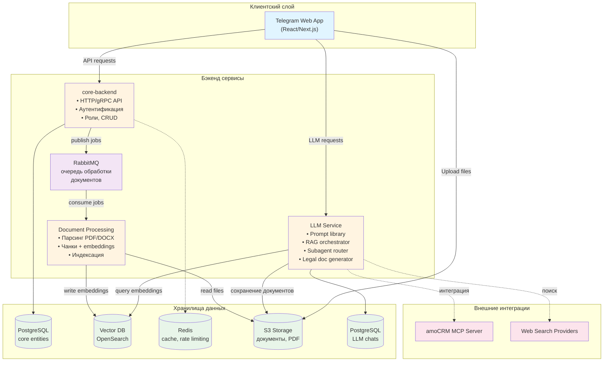

# BusinessThing — LLM‑помощник для владельцев малого и среднего бизнеса (Telegram Web App)

> **Статус:** Backend-компоненты реализованы (core-service, llm-service, doc-processing, telegram-bot). Frontend (WebApp) находится в разработке.

## 🔐 Авторизация через Telegram

BusinessThing использует Telegram WebApp для клиентского интерфейса. Авторизация происходит через валидацию `initData` от Telegram Mini App.

**Подробная документация:** [TELEGRAM_AUTH.md](./TELEGRAM_AUTH.md)

**Быстрый старт:**
1. Получите токен бота от [@BotFather](https://t.me/botfather)
2. Настройте `config.yaml` в `core-service`
3. Запустите `cmd/telegram-bot` с токеном
4. Используйте `/start` в боте → кнопка откроет WebApp

## 🧩 Назначение
BusinessThing предоставляет владельцу и команде малого/среднего бизнеса персонального интеллектуального помощника внутри привычного интерфейса Telegram. Приложение агрегирует контекст компании, внутренние документы, знания субагентов (маркетинг, право, финансы) и внешние источники (amoCRM, веб‑поиск) для ускорения принятия решений и подготовки материалов.

## 💼 Бизнес‑ценность
- Сокращение времени на подготовку договоров, маркетинговых материалов, аналитики.
- Централизованный «мозг» компании: единый контекст, заметки, документы, история генераций.
- Снижение зависимости от внешних консультантов благодаря встроенным профильным субагентам.
- Быстрый старт без установки: доступно как Telegram Web App (desktop + mobile).
- Повышение качества ответов за счет RAG (поиск по внутренней базе знаний + заметки + шаблоны).
- Актуализация информации через веб‑поиск и интеграции (Proof of Concept: amoCRM).

## 🔥 Боли, которые решаем
| Боль | Решение |
|------|---------|
| Разрозненные знания и файлы | Единое хранилище + векторный поиск + заметки LLM |
| Долгая подготовка типовых договоров | Генерация из шаблонов с автозаполнением и экспортом PDF/DOCX |
| Отсутствие системного маркетингового и финансового анализа | Профильные субагенты с инструментами (кампании, KPI, точка безубыточности) |
| Сложный онбординг новых сотрудников | Контекст организации и документы доступны сразу внутри Telegram |
| Нет актуализации ответов модели | Веб‑поиск + интеграции (amoCRM) для освежения данных |
| Риск утечки межорганизационных данных | Жесткая изоляция контекстов организаций + ролевая модель доступа |

## ✅ Ключевые возможности (MVP / PoC)
1. Создание организации и заполнение расширяемой анкеты (название, сфера, регион, оборот, сотрудники и др.).
2. Управление пользователями: приглашения одноразовой ссылкой, роли (Admin, Employee).
3. Общение с LLM в контексте организации (общие вопросы, рекомендации, анализ).
4. Заметки LLM об организации: просмотр/удаление, централизованное хранение.
5. RAG: загрузка документов (PDF, DOCX, TXT), извлечение текста, векторизация, поиск релевантных фрагментов.
6. Субагенты: маркетинг / право / финансы — маршрутизация запросов, специализированные промпты и инструменты.
7. Правовой агент: шаблоны договоров с параметрами → диалоговое заполнение → генерация → экспорт PDF/DOCX → список сгенерированных договоров.
8. Интеграция с amoCRM (через MCP сервер) — использование данных для обогащения контекста (PoC, хардкод аккаунта).
9. Веб‑поиск для проверки фактов и добавления свежих источников в промпт.
10. Безопасность: изоляция данных организаций, ролевая модель доступа к документам, заметкам и сгенерированным артефактам.

## 👥 Роли
- Admin (владелец организации): полный доступ, управление интеграциями, документами, пользователями.
- Employee (сотрудник): использование LLM, субагентов, документов (с учетом политики доступа).

## 🏛 Архитектура

```mermaid
graph TB
    subgraph Client["Клиентский слой"]
        WebApp["Telegram Web App<br/>(React/Next.js)"]
    end

    subgraph Backend["Бэкенд сервисы"]
        
        CoreBackend["core-backend<br/>• HTTP/gRPC API<br/>• Аутентификация<br/>• Роли, CRUD"]
        
        LLMService["LLM Service<br/>• Prompt library<br/>• RAG orchestrator<br/>• Subagent router<br/>• Legal doc generator"]
        
        DocProcessing["Document Processing<br/>• Парсинг PDF/DOCX<br/>• Чанки + embeddings<br/>• Индексация"]
        
        RabbitMQ["RabbitMQ<br/>очередь обработки<br/>документов"]
    end

    subgraph Storage["Хранилища данных"]
        PostgreSQL[(PostgreSQL<br/>core entities)]
        VectorDB[(Vector DB<br/>OpenSearch)]
        Redis[(Redis<br/>cache, rate limiting)]
        S3[("S3 Storage<br/>документы, PDF")]
        PostgreSQL-llm[(PostgreSQL<br/>LLM chats)]
    end

    subgraph External["Внешние интеграции"]
        AmoCRM["amoCRM MCP Server"]
        WebSearch["Web Search Providers"]
    end

    WebApp -->|API requests| CoreBackend
    WebApp -->|LLM requests| LLMService
    WebApp -->|Upload files| S3
    
    CoreBackend --> PostgreSQL
    CoreBackend -->|publish jobs| RabbitMQ
    
    LLMService -->|query embeddings| VectorDB
    LLMService -.->|интеграция| AmoCRM
    LLMService -.->|поиск| WebSearch
    LLMService --> |сохранение документов| S3
    LLMService --> PostgreSQL-llm
    
    RabbitMQ -->|consume jobs| DocProcessing
    DocProcessing -->|write embeddings| VectorDB
    DocProcessing --> |read files| S3
    
    CoreBackend -.-> Redis

    style WebApp fill:#e1f5ff
    style CoreBackend fill:#fff4e1
    style LLMService fill:#fff4e1
    style DocProcessing fill:#fff4e1
    style PostgreSQL fill:#e8f5e9
    style PostgreSQL-llm fill:#e8f5e9
    style VectorDB fill:#e8f5e9
    style Redis fill:#e8f5e9
    style S3 fill:#e8f5e9
    style RabbitMQ fill:#f3e5f5
    style AmoCRM fill:#fce4ec
    style WebSearch fill:#fce4ec
```

**Мониторинг и логирование:**
- Jaeger (distributed tracing)
- Dozzle (логи контейнеров)
- (Future) ClickHouse (аудит запросов)

## 🧠 Потоки данных (основные сценарии)
1. **Запрос пользователя к LLM:**
   - WebApp → LLM Service напрямую
   - LLM Service: Retrieval из Vector DB (query embeddings) + заметки + шаблоны из PostgreSQL
   - Сбор параметризованного промпта
   - Вызов LLM → Ответ + цитаты источников
   - Сохранение истории чата в PostgreSQL (LLM chats)

2. **Генерация договора:**
   - WebApp → LLM Service: инициация генерации
   - LLM Service: векторный поиск шаблона в Vector DB
   - LLM формирует список полей → WebApp отображает форму → пользователь заполняет
   - LLM генерирует финальный документ → рендер PDF/DOCX
   - Сохранение в S3 → запись метаданных через core-backend в PostgreSQL

3. **Загрузка и индексация документа:**
   - WebApp → S3: загрузка файла
   - WebApp → core-backend: создание записи документа
   - core-backend → RabbitMQ: публикация задачи на обработку
   - Document Processing: consume задачи из RabbitMQ
   - Document Processing: извлечение текста, разбиение на чанки, генерация embeddings
   - Document Processing → Vector DB: индексация (write embeddings)
   - Document Processing → core-backend: обновление статуса документа

4. **Интеграция amoCRM:**
   - LLM Service ↔ amoCRM MCP Server
   - Пуллинг / запрос данных CRM → нормализация
   - Включение сущностей (лиды, сделки) в контекст промптов

5. **Веб‑поиск:**
   - LLM Service → Web Search Providers: триггер инструмента поиска
   - Получение актуальных данных → краткие выдержки
   - Встраивание результатов в финальный промпт (с ограничением объема)

## 🧩 Компоненты
| Компонент | Ответственность |
|----------|-----------------|
| **frontend** | Telegram Web App UI, формы анкеты, чат с LLM, генерация договоров, загрузка файлов в S3 |
| **core-backend** | HTTP/gRPC API, аутентификация, управление ролями, CRUD организаций/пользователей/документов, публикация задач в RabbitMQ |
| **llm-agent** | Прямая обработка запросов от клиента, оркестрация LLM, промпты, субагенты, RAG (query из Vector DB), юридическая логика, интеграции (amoCRM, Web Search) |
| **vector-service** | Пассивное хранилище векторных представлений (OpenSearch), обеспечивает векторный и полнотекстовый поиск по запросам |
| **document-processing** | Воркер RabbitMQ: парсинг PDF/DOCX/TXT, нарезка на чанки, генерация embeddings, запись в Vector DB, чтение файлов из S3 |
| **amoCRM mcp** | MCP-сервер для интеграции с amoCRM, получение и нормализация данных CRM |

## 🗃 Данные и сущности (план)

**core-backend (PostgreSQL):**
- **Organization** — анкета компании + расширяемые поля
- **User** — роль, статус приглашения, связь с организацией
- **Note** — короткие заметки LLM об организации
- **Document** — метаданные документа (оригинал в S3, статус индексирования)
- **ContractTemplate** — шаблоны договоров (поля, описание, текстовые сегменты)
- **GeneratedContract** — сгенерированные договоры (заполненные значения, ссылки на PDF/DOCX в S3)

**llm-agent (PostgreSQL):**
- **ChatMessage** — история диалогов пользователей с LLM
- **PromptTemplate** — шаблоны промптов (тип субагента, параметры, версия)

**vector-service (OpenSearch):**
- **ChunkEmbedding** — векторные представления фрагментов текста + метаданные (ссылки на документы)

## 🛡 Безопасность и доступ
- Изоляция контекста: каждый запрос LLM ограничен текущей организацией.
- Role-based: операции модификации (шаблоны, заметки, пользователи) доступны только Admin.
- Rate limiting (Redis) для защиты от злоупотреблений.
- Будущее: аудит запросов (ClickHouse) + объяснимость выбора источников.

## 🔌 Интеграции
- amoCRM (PoC): обогащение контекста сделки/клиенты для более точных рекомендаций.
- Веб‑поиск: фактическая актуализация данных вне внутренней базы знаний.

## 🛠 Технологический стек (целевой)
- **Frontend:** React / Next.js (Telegram WebApp SDK)
- **Backend:** Go (gRPC + HTTP API)
  - core-backend: управление бизнес-сущностями
  - llm-agent: обработка LLM-запросов, RAG, субагенты
  - document-processing: воркер обработки документов
- **LLM:** внешние API (OpenAI / локальные модели, конфигурируемо), управление промптами
- **Vector DB:** OpenSearch (векторные и полнотекстовые запросы, пассивное хранилище)
- **Storage:** S3‑совместимое (MinIO / AWS S3) — документы, PDF, прямая загрузка с клиента
- **Queue:** RabbitMQ (асинхронная обработка документов между core-backend и document-processing)
- **DB:** PostgreSQL (core entities + LLM chats) + Redis (cache, rate limiting)
- **Observability:** Jaeger (tracing), Dozzle (logs)
- **(Будущее)** ClickHouse — аудит запросов

## 🚀 Quick Start (плейсхолдер)
> Код сервисов пока отсутствует. Ниже — целевые шаги запуска (будут дополнены).

1. **Инфраструктура:** Поднять PostgreSQL, Redis, OpenSearch, RabbitMQ, S3 (MinIO)
2. **Переменные окружения:** Настроить конфигурацию для всех сервисов (DB, S3, LLM API keys, amoCRM credentials)
3. **core-backend:** Запустить gRPC/HTTP API сервер
4. **llm-agent:** Запустить LLM Service (прямой доступ от клиента)
5. **document-processing:** Запустить воркер обработки очереди RabbitMQ
6. **frontend:** Собрать и задеплоить Telegram Web App, настроить BotFather
7. **Интеграции:** Подключить amoCRM MCP сервер (PoC конфигурация)

## 📚 Промпты и субагенты
- Шаблоны промптов хранятся версионируемо в базе.
- Параметры (температура, max_tokens) управляются политикой организации.
- Субагенты используют специализированные цепочки инструментов.

## 🗺 Roadmap (выдержка)
| Этап | Задачи |
|------|--------|
| PoC | Базовый чат, анкета, заметки, загрузка документов, amoCRM интеграция |
| MVP | Генерация договоров + экспорт, субагенты, ролевая модель, базовый веб‑поиск |
| Beta | Объяснимость RAG, аудит в ClickHouse, динамическое автозаполнение анкеты (по сайтам/юридическим данным) |
| GA | Масштабирование, многоорганизационная оптимизация, расширенные шаблоны и маркетинговые воркфлоу |

## 🤝 Контрибьюция и стиль
- Следовать принятой чистой архитектуре: сервисный слой работает только с доменными моделями и DTO.
- Единый кодстайл между всеми сервисами (детали будут формализованы позже).
- Использовать доменные ошибки для маппинга HTTP/gRPC статус кодов.
- Не добавлять избыточные Markdown файлы — только необходимая документация.

## ⚠ Ограничения текущей стадии
- Код сервисов еще не реализован (директории пусты).
- amoCRM интеграция в PoC режиме (жестко заданный аккаунт).
- Нет реализации логов объяснимости RAG, аудита запросов и автозаполнения анкеты.

## 📄 Лицензия
> Будет определена позднее.

---
BusinessThing — ускоряем принятие решений и освобождаем часы рутины для реального роста бизнеса.
